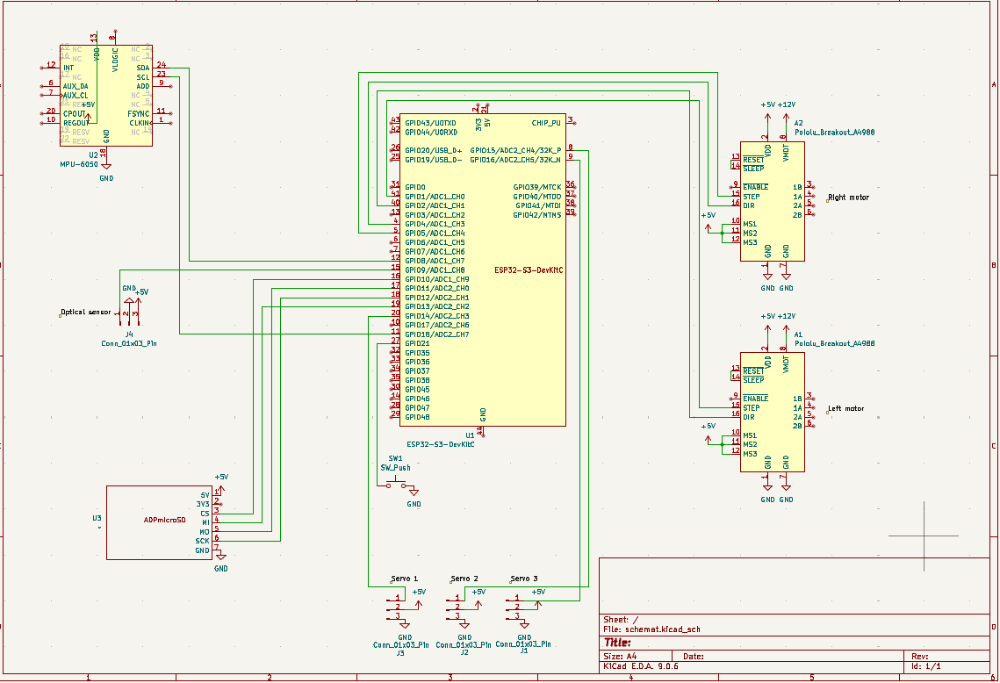
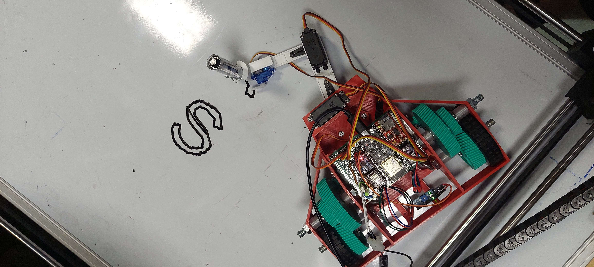

### RoboScribe - Robot Skryba
Witamy w dokumentacji technicznej projektu **RoboScribe**.
Jest to robot który zmienia tekst napisany w aplikacji na fizyczny napis na tablicy magnetycznej.

---
**Główne możliwości robota:**
* **✏️ Przetwarzanie danych na ruch:** Oprogramowanie automatycznie zamienia wpisany tekst na format wektorowy (SVG), a następnie generuje z niego instrukcje ścieżkowe (G-Code) zrozumiałe dla silników.
* **🖥️ Wygodne sterowanie (GUI):** Intuicyjny interfejs graficzny na PC pozwala na tworzenie plików dla robota i jego łatwą obsługę i sterowanie.
* **📡 Komunikacja Wi-Fi:** Połączenie z robotem odbywa się bezprzewodowo, co pozwala na wygodne sterowanie urządzeniem i przesyłanie poleceń bezpośrednio z poziomu aplikacji na komputerze.
* **⚙️ Precyzja kreślenia:** Zaawansowana kontrola silników krokowych dba o dokładne pozycjonowanie na tablicy, a serwomechanizm płynnie podnosi i opuszcza pisak.
* **⚖️ Telemetria:** Wykorzystanie czujnika MPU6050 (akcelerometr) umożliwia bieżące monitorowanie orientacji urządzenia podczas pracy.

---

## 📂 Struktura Projektu

Poniższe drzewo przedstawia organizację projektu oraz ich przeznaczenie.

<pre>
📦 RoboScribe
 ├── 📁 docs              # Dokumentacja projektu
 ├── 📁 firmware          # Kod źródłowy robota
 │   ├── 📁 drivers       # Warstwa sprzętowa (HAL)
 │   │   ├── 📁 MPU6050         → Obsługa akcelerometru
 │   │   ├── 📁 SDcard          → Obsługa czytnika kart SD
 │   │   ├── 📁 servo           → Obsługa serwomotorów
 │   │   ├── 📁 stepperMotors   → Obsługa silników krokowych
 │   │   └── 📁 wifiComms       → Komunikacja Wi-Fi
 │   └── 📁 main          # Główna pętla programu i logika sterowania
 └── 📁 software          # Oprogramowanie pomocnicze na PC
     ├── 📁 GCODEgen            → Generator ścieżek G-Code
     ├── 📁 GUI                 → Interfejs graficzny
     └── 📁 TextToSvg           → Konwersja tekstu na grafikę wektorową
</pre>

### Schemat Elektroniczny

### Zdjęcia Robota

